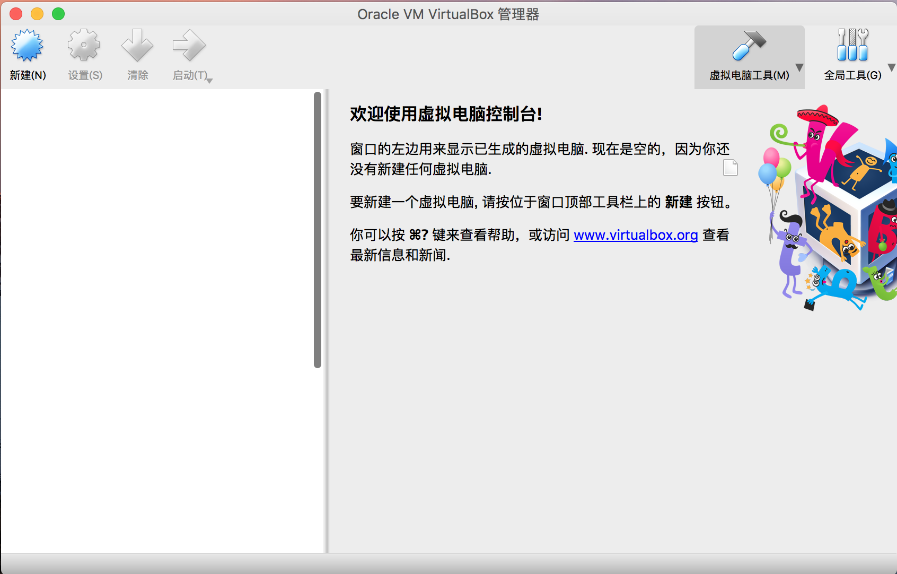
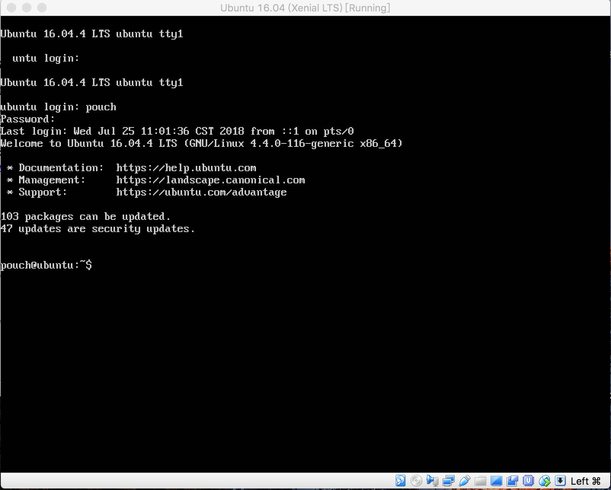
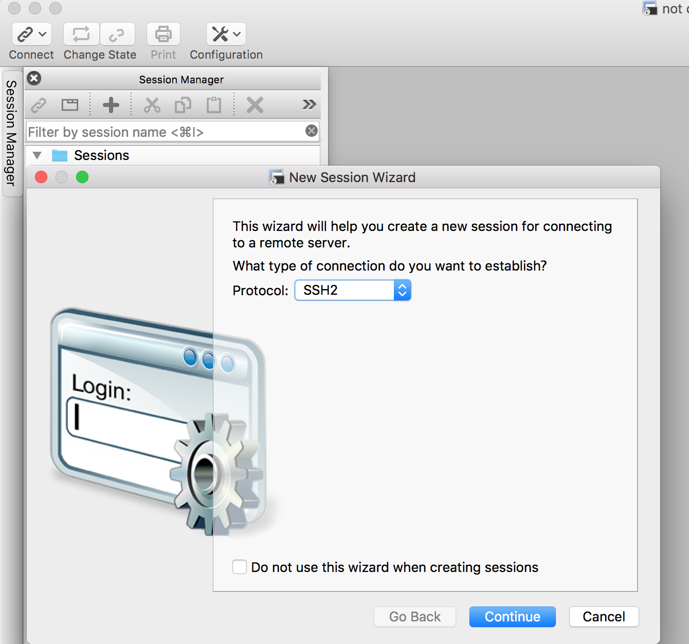
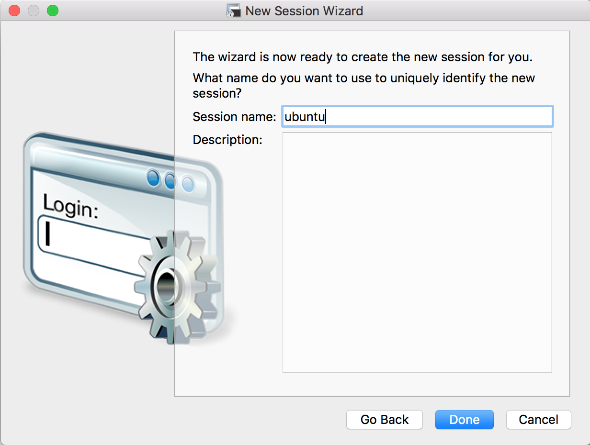
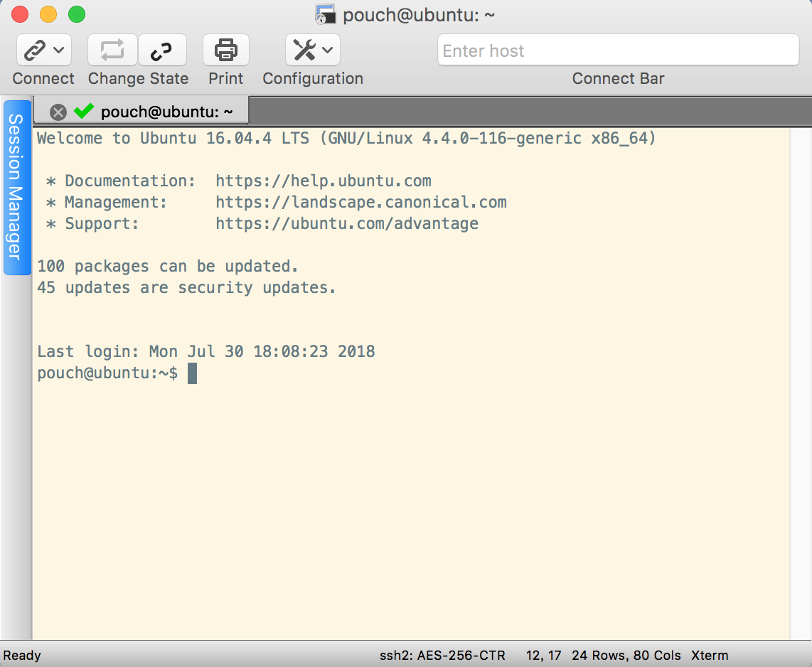

# PouchContainer 初体验

## 0x00 背景介绍

PouchContainer是一款由阿里巴巴开源的高效、轻量的企业级富容器引擎技术，具有隔离性强、可移植性高、资源占用少的特性。 PouchContainer是企业级容器方案，只支持Linux操作系统，我们可以使用虚拟机快速搭建一个本地运行和测试环境。参考步骤如下。

## 0x01 本地虚拟机安装 

当前，PouchContainer支持两种版本的Linux发行版：Ubuntu和CentOS，我们以Ubuntu虚拟机安装PouchContainer为例：

### **Ubuntu**

1. 其中Ubuntu支持的版本为：Ubuntu 16.04 (Xenial LTS)，可以从钉钉群下载对应的**ubuntu.vdi**文件。


2. 下载并安装**VirtualBox**。

   

3. 安装成功后，打开VirtualBox如下。



4. 选择**新建**->填写**名称**->**类型**选择Linux->**版本**选择Ubuntu（64-bit）->**内存大小**选择1024MB->选择**使用已有的虚拟硬盘文件**，点击📁图标选择之前下载的**ubuntu.vdi**文件->点击**创建**。

   

5. 点击**启动**开启虚拟机。

6. 等到进入登陆阶段，ubuntu.vdi的用户名为**pouch**，密码为**123456**，登陆ubuntu虚拟机。

   

## 0x02 配置PouchContainer支持

1. **PouchContainer**与**Docker**发生冲突，因此必须在安装PouchContainer之前卸载Docker，这里Ubuntu没有装docker所以无需卸载。

   

### 安装依赖项

1. PouchContainer支持**LXCFS**用以提供强大的隔离，所以需要首先安装LXCFS。默认情况下，LXCFS已经启用。

    ```shell
    sudo apt-get install lxcfs
    ```

    

2. 安装下面的包以允许“apt”通过**HTTPS**使用资源库。

   ```shell
   sudo apt-get install curl apt-transport-https ca-certificates software-properties-common
   ```

   

### 添加PouchContainer的官方GPG密钥
1. 添加PouchContainer的官方**GPG**密钥

   ```shell
   curl -fsSL http://mirrors.aliyun.com/opsx/pouch/linux/debian/opsx@service.alibaba.com.gpg.key | sudo apt-key add -
   ```

   

2. 通过搜索指纹的后8个字符，确认你现在有了指纹F443 EDD0 4A58 7E8B F645 9C40 CF68 F84A BE2F 475F的密钥。

   ```shell
   apt-key fingerprint BE2F475F
   pub   4096R/BE2F475F 2018-02-28
         Key fingerprint = F443 EDD0 4A58 7E8B F645  9C40 CF68 F84A BE2F 475F
   uid                  opsx-admin <opsx@service.alibaba.com>
   ```
   

### 设置PouchContainer储存库

   1. 首次在虚拟机上安装PouchContainer前，需要设置PouchContainer储存库。我们默认启用了`stable`存储库。要添加测试存储库，请在下面的命令行中，在单词`stable`之后添加`test`。之后可以从存储库安装和更新PouchContainer。

       ```shell
       sudo add-apt-repository "deb http://mirrors.aliyun.com/opsx/pouch/linux/debian/ pouch stable"
       ```

       


### 安装PouchContainer

1. 安装最新版本的PouchContainer。

   ```shell
   # update the apt package index
   sudo apt-get update
   sudo apt-get install pouch
   ```

   

   在安装了PouchContainer之后，将创建`pouch`组，但不向该组添加任何用户。

### 启动PouchContainer

1. 启动和关闭**PouchContainer**

   ```shell
   sudo service pouch start
   sudo service pouch stop
   ```

   

2. 之后，可以拉一个镜像并运行PouchContainer容器，以**busybox**为例。

   ```shell
   sudo pouch pull reg.docker.alibaba-inc.com/busybox:latest
   sudo pouch run -t -d busybox sh
   ```

   

3. 执行下面的命令登入启动的容器，其中ID是上条命令输出的完整ID中的前六位，本例中为15a311。

   ```shell
   sudo pouch exec -it {ID} sh
   ```

   

## 0x03 开发环境配置的一些经验

### 使用SecureCRT登陆VirtualBox

1. 这一方法适用于使用本地的terminal、Xshell等代理远程登录管理Ubuntu虚拟机。步骤：**设置**->网络连接方式为**网络地址转换（NAT）**选择**高级**->**端口转发**->**OK**

   

2. SecureCRT选择SessionManager点击**+** ->出现New Session Wizard->**continue**。

   

3. **Hostname**配置为127.0.0.1->**Port**配置为2222->**Username**配置为Ubuntu主机的用户名，这里为pouch->**Continue**。

   

4. 配置**Session name**。

   

5. 输入之前的**Username**和**Password**。

   

6. 得到一个Ubuntu的**session**。

   

### 挂载本地的pouch代码库到Virtualbox中

1. 首先使用git fork pouch到自己的代码库，然后克隆pouch到本地文件夹。

   ```shell
   git clone https://github.com/YangLoong/pouch.git
   ```

2. 将本地文件夹共享到Virtualbox。

   

3. 配置Virtualbox，选择Devices->Insert Guest Additions CD images... 然后虚拟机中配置Virtualbox相关内容

   ```shell
   sudo mount /dev/sr0 /media/cdrom
   cd /media/cdrom/
   ls
   sudo sh VBoxLinuxAdditions.run
   ```

   

4. 挂载共享文件夹到/root/gopath/src/github.com/alibaba/pouch 

   ```shell
   sudo su
   mount -t vboxsf pouch /root/gopath/src/github.com/alibaba/pouch
   ```

   