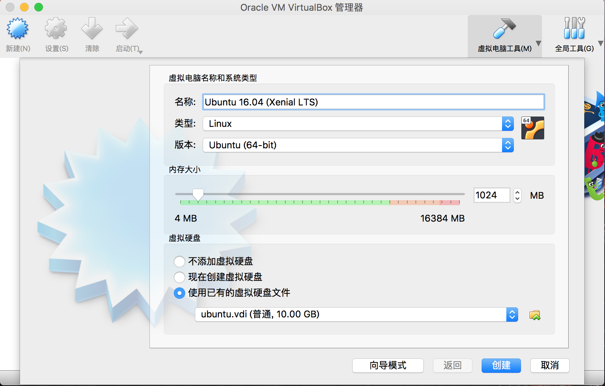
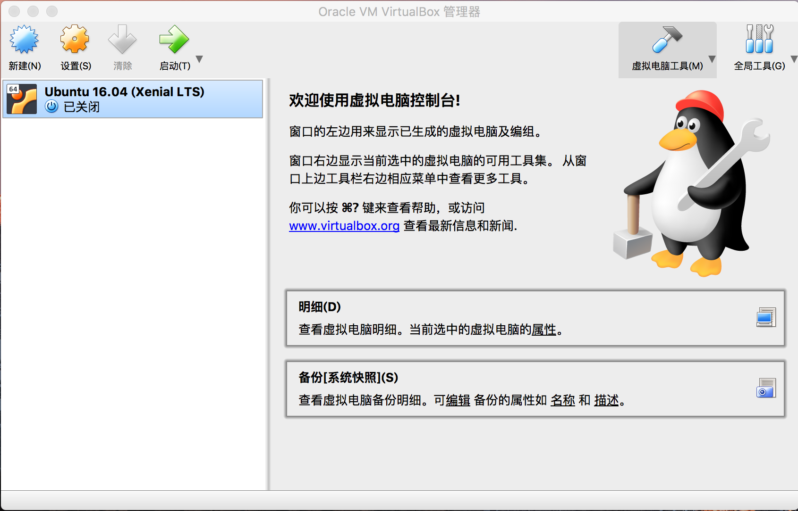
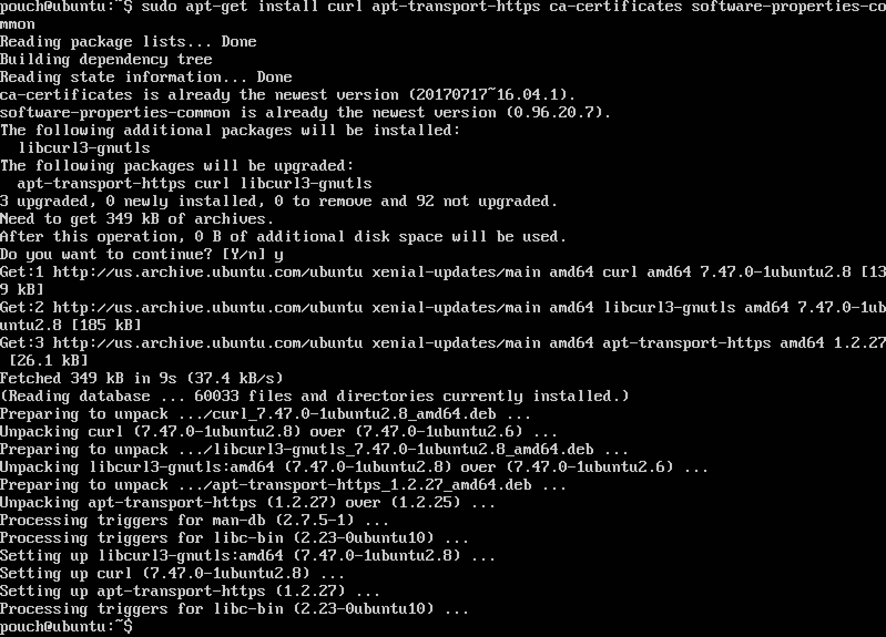
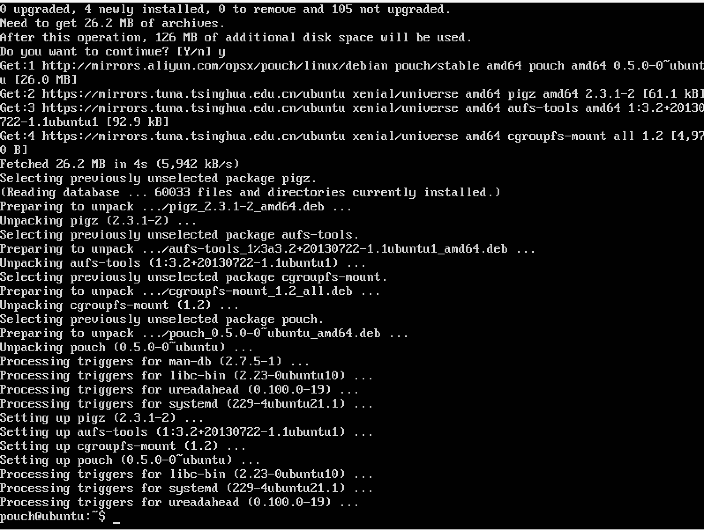
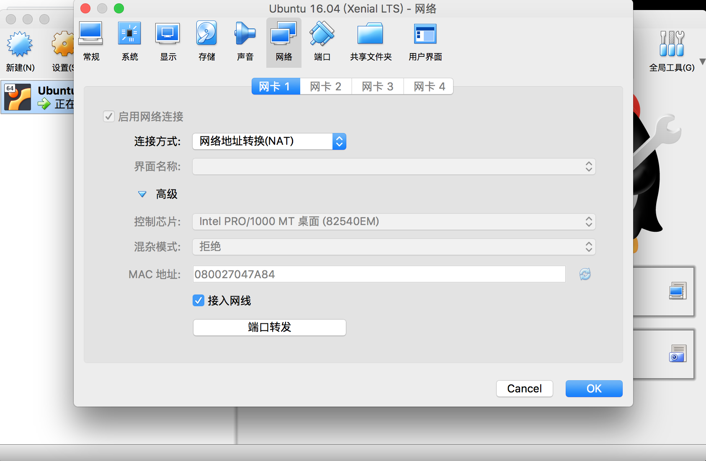
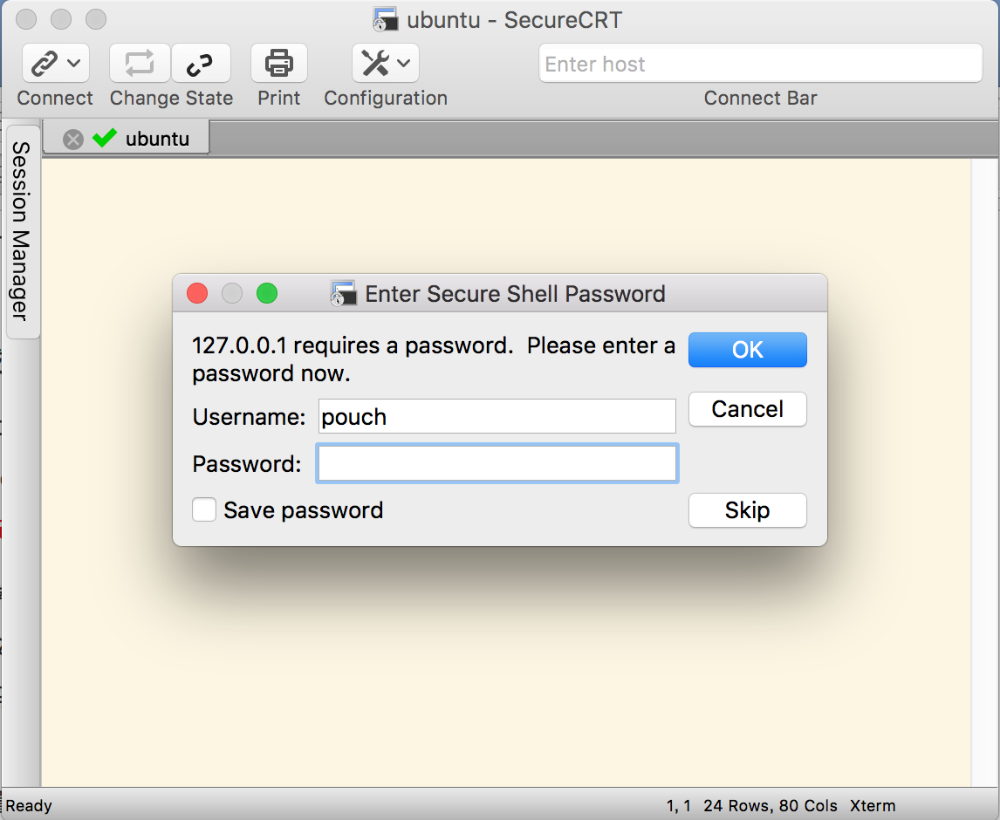
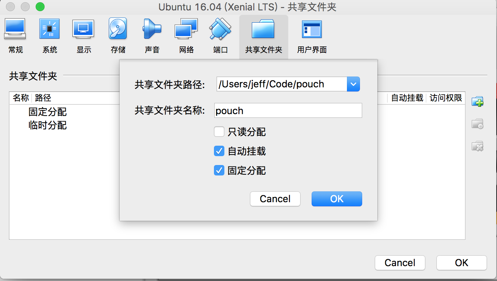
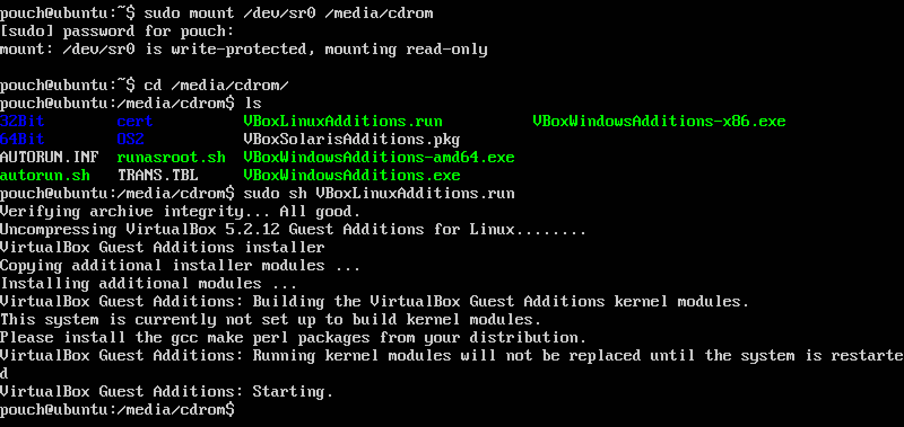

# Head First PouchContainer

## 0x00 Background Introduction

PouchContainer is an open source engine with efficient, lightweight, enterprise-class, rich container features developed by alibaba. It is a strong isolation, high portability, and low resource consumption engine as well. PouchContainer only supports the Linux operating system, and we could quickly build a local running and testing environment via a virtual machine. The steps are as follows.

## 0x01 Installation of Virtual Machine 

Currently，PouchContainer supports two kinds of Linux Distribution: Ubuntu and CentOS，here, we would take PouchContainer installation on Ubuntu virtual machine as example：

### **Ubuntu**

1. To install PouchContainer, you need a maintained version of Ubuntu 16.04 (Xenial LTS), which is provided with a **ubuntu.vdi** file and could be obtained from DingDing group. Archived versions of Ubuntu aren't supported or tested.


2. Download and install **VirtualBox**。

   

3. After installing successfully，we could open VirtualBox as follows.


4. Choose **New** -> Filling in **Name** -> Select Linux as **Type** ->Select Ubuntu(64-bit) as **Version** -> Select 1024 MB as **Memory Size** -> Select **Use an existing virtual hard disk file**, click icon 📁and select the **ubuntu.vdi** file that we downloaded before -> Click **Create**.

   

5. Click **Start** to start the virtual machine.

6. Wait until you get into the login stage，User name of ubuntu.vdi is **pouch**, and password is **123456**, then we will log into the ubuntu virtual machine.

   

## 0x02 PouchContainer Configuration

1. PouchContainer is conflict with Docker, so you must uninstall Docker before installing PouchContainer. Here, package 'docker' is not installed, so you don't have to remove it.

   

### Prerequisites

1. PouchContainer supports LXCFS to provide strong isolation, so you should install LXCFS firstly. By default, LXCFS is enabled.。

    ```shell
    sudo apt-get install lxcfs
    ```

    

2. Install packages to allow 'apt' to use a repository over HTTPS:

   ```shell
   sudo apt-get install curl apt-transport-https ca-certificates software-properties-common
   ```

   

### Add PouchContainer's official GPG key

1. Add PouchContainer's official GPG key

   ```shell
   curl -fsSL http://mirrors.aliyun.com/opsx/pouch/linux/debian/opsx@service.alibaba.com.gpg.key | sudo apt-key add -
   ```

   

2. Verify that you now have the key with the fingerprint `F443 EDD0 4A58 7E8B F645 9C40 CF68 F84A BE2F 475F`, by searching for the last 8 characters of the fingerprint.

   ```shell
   apt-key fingerprint BE2F475F
   pub   4096R/BE2F475F 2018-02-28
         Key fingerprint = F443 EDD0 4A58 7E8B F645  9C40 CF68 F84A BE2F 475F
   uid                  opsx-admin <opsx@service.alibaba.com>
   ```
   

### Set up the PouchContainer repository

   1. Before you install PouchContainer for the first time on a new host machine, you need to set up the PouchContainer repository. We enabled `stabel` repository by default, you always need the `stable` repository. To add the `test` repository, add the word `test` after the word `stable` in the command line below. Afterward, you can install and update PouchContainer from the repository.

       ```shell
       sudo add-apt-repository "deb http://mirrors.aliyun.com/opsx/pouch/linux/debian/ pouch stable"
       ```

       


### Install PouchContainer

1. Install the latest version of PouchContainer. 

   ```shell
   # update the apt package index
   sudo apt-get update
   sudo apt-get install pouch
   ```

   

   After installing PouchContainer, the `pouch` group is created, but no users are added to the group.

### Start PouchContainer

1. Start and stop **PouchContainer** on Ubuntu.

   ```shell
   sudo service pouch start
   sudo service pouch stop
   ```

   

2. Afterwards, you can pull an image and run PouchContainer containers, we will take **busybox** as example.

   ```shell
   sudo pouch pull reg.docker.alibaba-inc.com/busybox:latest
   sudo pouch run -t -d busybox sh
   ```

   

3. Execute the following command to log into the PouchContainer, the ID is the first six characters that the previous command outputs, in our case, it is 15a311.

   ```shell
   sudo pouch exec -it {ID} sh
   ```

   

## 0x03 Several suggestions on development environment configuration

### Using SecureCRT to login VirtualBox

1. The method is suitable for terminal、Xshell and other agents for managing Ubuntu virtual machine remotely. Steps：**Settings**->Attached to: **NAT** -> Choose **Advanced** -> **Port Forwarding** -> **OK**.

   

2. In SecureCRT choose SessionManager and cick **+** -> We have New Session Wizard -> Choose **continue**.

   

3. Select 127.0.0.1 as **Hostname** -> Select 2222 as **Port** -> Select user's name of vitual machine as **Username**, in our case, it is pouch -> Click **Continue**.

   

4. Select **Session name**.

   

5. Enter the previous **Username** and **Password**.

   

6. Finally, we could get an Ubuntu **session**.

   

### Mount local pouch repository to Virtualbox.

1. First, fork pouch to your own repsoitory with git, then clone pouch to local folder.

   ```shell
   git clone https://github.com/YangLoong/pouch.git
   ```

2. Add local pouch forder as share folder for Virtualbox.

   

3. Configure Virtualbox, and choose Devices -> Insert Guest Additions CD images... Then we configure the Virtualbox addition tool in the virtual machine.

   ```shell
   sudo mount /dev/sr0 /media/cdrom
   cd /media/cdrom/
   ls
   sudo sh VBoxLinuxAdditions.run
   ```

   

4. Mount share folder to /root/gopath/src/github.com/alibaba/pouch .

   ```shell
   sudo su
   mount -t vboxsf pouch /root/gopath/src/github.com/alibaba/pouch
   ```

   